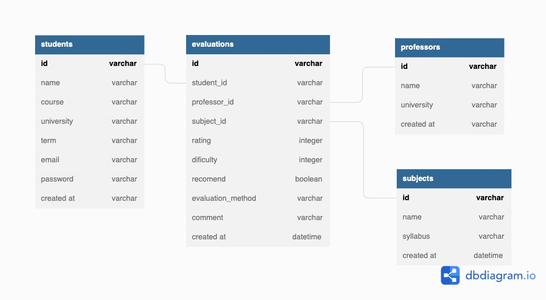

# TP1_Engenharia_De_Software
## Escopo do Sistema
Sistema de Avaliação de Matérias do Ensino Superior

## Principais Features

- Login  
- Cadastro  
- Valiação das Matérias  

## Tecnologias

<div style="display: inline_block" ><br/>
  
  
  
  
  
  
 

  
</div><br/>

## Membros da Equipe

1. Gabriel Alves Reis  
1. Luisa V. Toledo  
1. Thiago Miarelli  
1. Bernardo Borges  

## Backlog do produto

 ✍️ Eu como aluno gostaria de me cadastrar na plataforma utilizando meu email e senha.
</br>
✍️ Eu como aluno gostaria de fazer login na plataforma utilizando meu email e senha.
</br>
✍️ Eu como aluno gostaria de visualizar os meus dados de cadastro e estudantis.
</br>
✍️ Eu como aluno gostaria de visualizar uma lista de matérias disponíveis para avaliação.
</br>
✍️ Eu como aluno gostaria de pesquisar uma matéria por nome, professor ou código.
</br>
✍️ Eu como aluno gostaria de visualizar detalhadamento avaliações de uma matéria.
</br>
✍️Eu como aluno gostaria de avaliar uma  matéria e um professor que tive aula.
</br>
✍️ Eu como aluno gostaria de visualizar as últimas avaliações que fiz.
</br>
 ✍️ Eu como aluno gostaria de buscar uma matéria pela ementa.
</br>
✍️ Eu como aluno gostaria de ver todos os professores referentes a essa matéria para avaliar sua dicencia.   
</br>
 ✍️ Eu como aluno quero ser capaz de deletar uma avaiação que fiz.
</br>

## Backlog da Sprint

<details>
    <summary>
        ✍️ 01 - Eu como aluno gostaria de me cadastrar na plataforma utilizando meu email e senha.
    </summary>

### UX

- Realizar prototipação tela (Thiago Miareli)

### Front

- Realizar visual da tela de cadastro (Thiago Miareli)
- Reaizar conexão com Back-End (Gabriel Alves Reis)

### Back

- Criar entidade ALUNO no banco de dados (Bernardo Borges)
- Criar endpoint ```/aluno/signin``` "Criar Usuario" que recebe os
dados de usuario e cria um novo aluno, com email e senha. (Luisa V. Toledo)

</details>  
</br>

<details>
    <summary>
        ✍️ 02 - Eu como aluno gostaria de fazer login na plataforma utilizando meu email e senha.
    </summary>

### Front

- Realizar visual da tela de login (Gabriel Alves Reis)
- Realizar conexão com Back-End (Thiago Miareli)
- Modal de erro (Gabriel Alves Reis)

### Back
- Criar endpoint ```/aluno/login``` "Logar como aluno" que recebe usuario e senha e autentica se o aluno existe e tem a senha correta. Caso contrario retorna erro para o front. (Bernardo Borges)
- Implementar hash da senha e salvar no bd de forma segura. (Luisa V. Toledo)
</details>
</br>

<details>
    <summary>
        ✍️ 03 - Eu como aluno gostaria de visualizar os meus dados de cadastro e estudantis.
    </summary>

### Front

- Realizar conexão com Back-End, para acesso aos dados do aluno. (Gabriel Alves Reis)
- Realizar visual da tela. (Thiago Miareli)

### Back

- Criar endpoint GET ```aluno/${id}``` "Meus Dados" que retorna os dados do aluno logado. (Bernardo Borges)

</details>
</br>

<details>
    <summary>
        ✍️ 04 - Eu como aluno gostaria de visualizar uma lista de matérias disponíveis para avaliação.
    </summary>

### Front

- Criar input de texto para filtro. (Thiago Miareli)
- Criar component Card. (Gabriel Alves Reis)
- Listar matérias retornadas pela API por meio de cards. (Thiago Miareli)

### Back
- Criar endpoint GET ```subject?q=${filtro}``` "Listar Materia" que retorna todas as materia cadastradas, seguindo o filtro. (Luisa V. Toledo)
</details>
</br>

<details>
    <summary>
        ✍️ 05 - Eu como aluno gostaria de pesquisar uma matéria por nome, professor ou código.
    </summary>

### Front

- Realizar a função de filtro para nome da matéria.  (Gabriel Alves Reis)
- Realizar a função de filtro para código da matéria. (Thiago Miareli)
- Realizar a função de filtro para nome do professor. (Gabriel Alves Reis)

### Back
- Criar endpoint GET ```subject``` "Listar Materias" que retorna todas materias do sistema (Bernardo)
</details>
</br>


<details>
    <summary>
        ✍️ 06 - Eu como aluno gostaria de visualizar detalhadamento avaliações de uma matéria.
    </summary>

### Front

- Mostar informações gerais (estrelas, ementa). (Thiago Miareli)
- listar professores da matéria selecionada  (Gabriel Alves Reis)
- lsitar avaliações da matéria selecionada. (Thiago Miareli)

    
### Back
- Criar endpoint GET ```subject/${id}``` "Dados da Materia por ID" que retorna uma materia especifica, com todos seus dados:   (Luisa V. Toledo)
<code style="white-space:pre">
{
    id
    nome
    ementa
    codigo
}
</code>

- Criar endpoint GET ```evaluations/${subjectId}``` "Listar Avaliacoes dessa materia" que retorna todas as avaliacoes ja feitas dentro dessa materia

</details>
</br>

<details>
    <summary>
        ✍️ 07 - Eu como aluno gostaria de avaliar uma  matéria e um professor que tive aula.
    </summary>

### Front

- Criar tela de Seleção de matéria a ser avaliada.   (Gabriel Alves Reis)
- Criar tela de avaliação da matéria. (Thiago Miareli)
- Criar tela de avaliação de professores.  (Gabriel Alves Reis)
- Criar tela de comentários gerais. (Thiago Miareli)
- Conexão com backend.  (Gabriel Alves Reis)

### Back
- Criar o endpoint POST ```evaluations/create``` "Criar uma Avaliacao" que recebe todos os dados de uma avaliacao e os salva no banco de dados (Bernardo)
</details>
</br>

<details>
    <summary>
        ✍️ 08 - Eu como aluno gostaria de visualizar as últimas avaliações que fiz.
    </summary>

### Front
- Criar lista de "minhas avaliações" na tela do aluno  (Thiago Miareli)

### Back
- Criar enpoint GET ```evaluations/last``` "Lista ultimas avaliacoes do aluno" que retorna a lista com as ultimas avaliacoes desse aluno. (Luisa V. Toledo)


</details>
</br>

<details>
    <summary>
        ✍️ 09 - Eu como aluno gostaria de ver todos os professores referentes a essa matéria para avaliar sua dicencia.
    </summary>

### Front
- Na tela de avaliação de professores, colocar um select/autocomplete com apenas os professores relacionados a matéria que está sendo avaliada.  (Gabriel Alves Reis)

### Back
- Criar endpoint GET ```teachers/${subjectId}``` "Listar Professores da Materia" que retorna a lista com os professores associados a essa materia. (Bernardo)
</details>
</br>

<details>
    <summary>
        ✍️ 10 - Eu como aluno quero ser capaz de deletar uma avaiação que fiz.
    </summary>
    
### Front
- Criar funcionalidade de deletar uma avaliação na tela do usuário. Utilizar rota: delete('evaluations/${id}'). (Thiago Miareli)

### Back
- Criar endpoint DELETE ```evaluations/${id}``` "Deletar Avaliacao" que permite o usuario criador dessa avaliacao deleta-la. (Luisa V. C. Toledo)
</details>


## Banco de Dados


